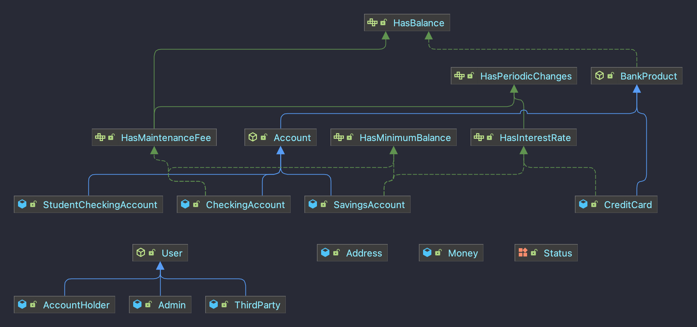

# Spring Banking

### What is Spring Banking?

Spring Banking is a simulated banking system, built by @jsblanco as the final project for the Ironhack Java Backend
Bootcamp, that ran from July October 2022.

This system has four main product:

* **Credit cards**
* **Checking accounts**
* **Student checking accounts** (for people younger than 24)
* **Savings accounts**

At the same time, there are three kinds of users:

* **Admins**, who have free reign upon the app
* **Account holders**, who can check their products and operate with them, but depend on admins to create, update or delete these products;
* **Third party users**, who own no products, but can operate on other people's products under specific circumstances.

### How to use
You must run this app using *Maven*. When running, the app provides a REST API for users to interact with. Attached you will find a Postman collection mocking the main calls of this project.

### Class Diagram
#### Models

#### Complete app

#### Use case diagram

